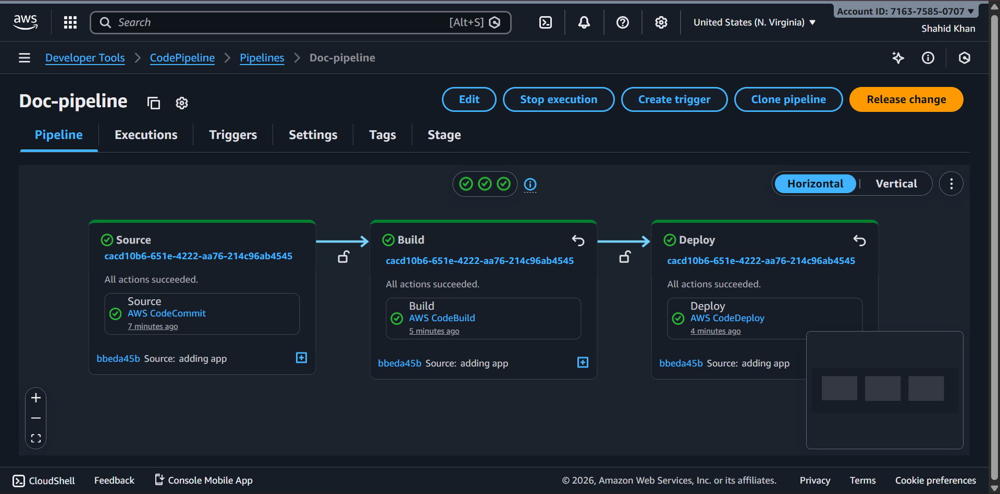
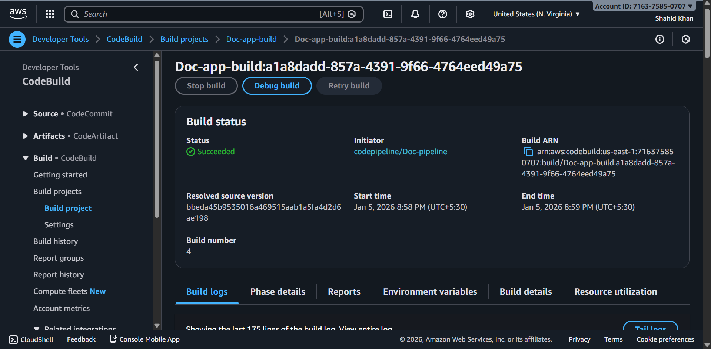
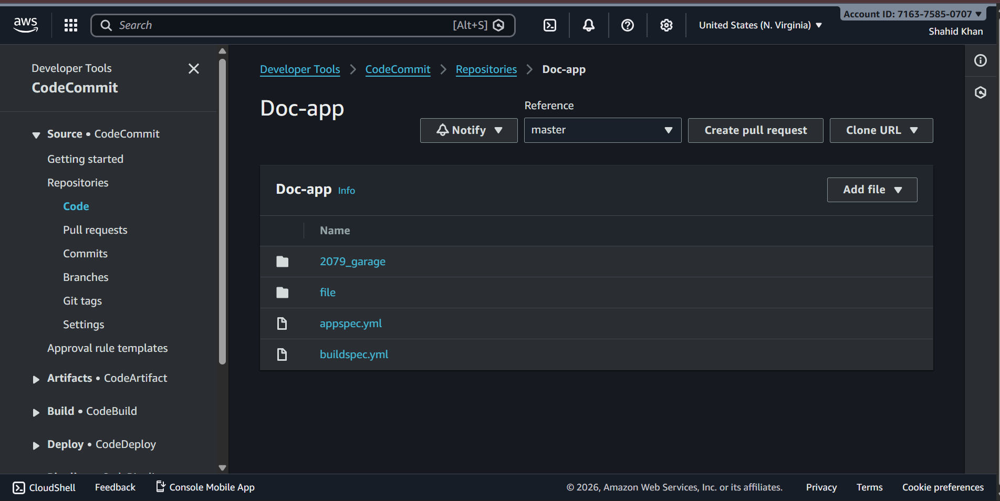
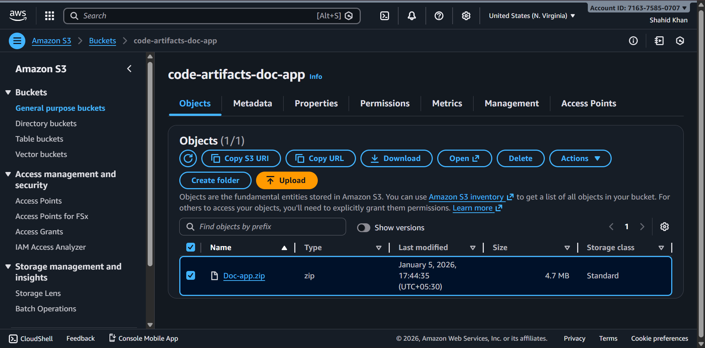
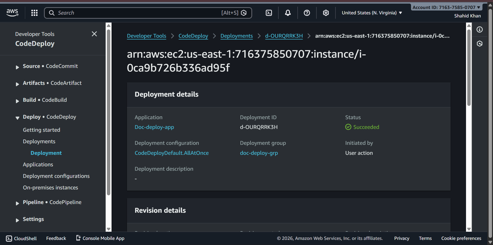
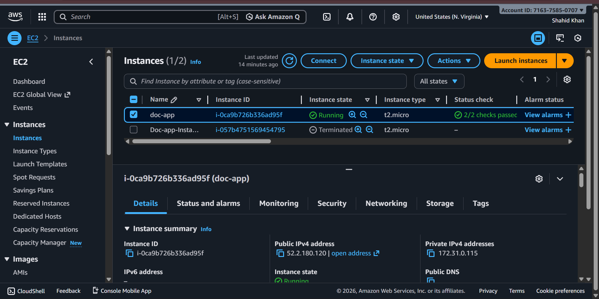
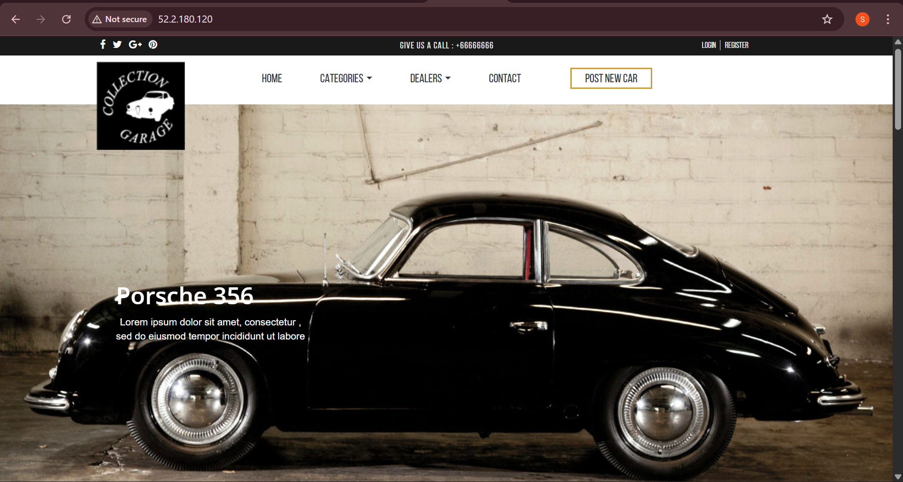
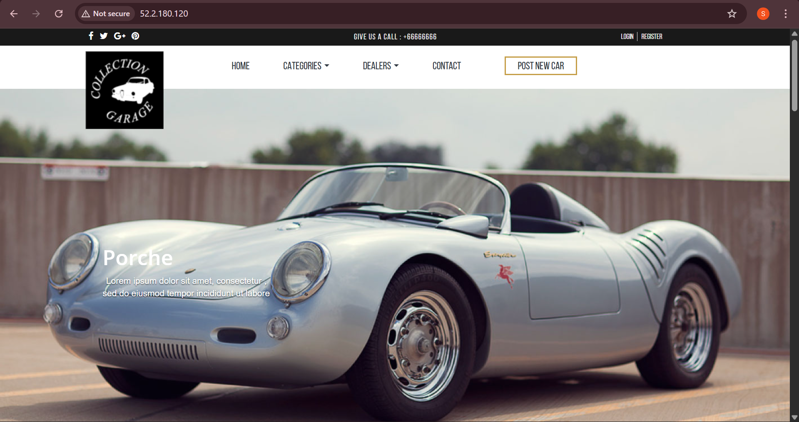

# AWS CodePipeline for EC2 App


Static site for the 2079 Garage theme deployed to EC2 via CodePipeline + CodeDeploy.


## Repo Structure
- Doc-app/buildspec.yml – CodeBuild phases to install nginx and copy `2079_garage` into the build artifact
- Doc-app/appspec.yml – CodeDeploy mapping to `/var/www/html` plus lifecycle hooks
- Doc-app/2079_garage/ – Site assets (HTML, CSS, JS, images)
- Doc-app/file/script.sh – Installs and enables nginx (AfterInstall)
- Doc-app/file/start-nginx.sh – Starts/enables nginx and checks status (ApplicationStart)
- Doc-app/file/codedeploy-agent-installation-Ubuntu22.04.sh – Helper to install CodeDeploy agent on Ubuntu 24.04 (Noble)

## Pipeline Flow (AWS CodePipeline)
1) **Source** → pulls this repo
2) **Build (CodeBuild)** → runs `buildspec.yml`
   - Installs nginx
   - Copies `2079_garage` into `/var/www/html` (then packaged as artifact)
3) **Deploy (CodeDeploy)** → runs `appspec.yml`
   - Copies `2079_garage` artifact to `/var/www/html`
   - Hooks: AfterInstall → `file/script.sh`; ApplicationStart → `file/start-nginx.sh`

## End-to-End Steps
1) **Prep EC2** (Ubuntu 24.04)
   - Enable auto-assign public IP or attach an Elastic IP
   - Attach IAM role with **AmazonEC2RoleforAWSCodeDeploy**
   - Open SG inbound: TCP 80 (HTTP); add 443 if using TLS
2) **Install CodeDeploy Agent**
   ```bash
   cd /tmp
   curl -O https://aws-codedeploy-us-east-1.s3.us-east-1.amazonaws.com/latest/install
   chmod +x install
   sudo ./install auto
   sudo service codedeploy-agent status
   ```
   Or run helper: `Doc-app/file/codedeploy-agent-installation-Ubuntu22.04.sh` (works on 24.04).
3) **Create / Run Pipeline**
   - Source: this repo
   - Build: CodeBuild using `Doc-app/buildspec.yml`
   - Deploy: CodeDeploy using `Doc-app/appspec.yml`
4) **Verify Deployment**
   ```bash
   # On EC2
   sudo systemctl status nginx
   curl -I http://localhost
   # From your machine
   curl -I http://<public-ip>
   ```
5) **If ERR_CONNECTION_REFUSED**
   - Ensure public/Elastic IP is attached
   - SG allows inbound TCP 80
   - `sudo systemctl status nginx` is active
   - `sudo ss -tlnp | grep 80` shows nginx listening

## Build and Deploy Steps (summary)
1) Push code to the repository
2) CodePipeline triggers CodeBuild → runs `buildspec.yml`
3) Artifact is stored in S3
4) CodeDeploy deploys artifact to EC2 using `appspec.yml`
5) Hooks run to install and start nginx
6) Verify site at the instance public IP

## EC2 Prereqs
- Instance profile attached with **AmazonEC2RoleforAWSCodeDeploy** (or equivalent)
- Security group with inbound TCP 80 (HTTP) and 443 (if using TLS)
- Outbound allowed to the internet (for agent and updates)
- Public IP or Elastic IP attached (required for external access)

## CodeDeploy Agent (Ubuntu 24.04)
Use `Doc-app/file/codedeploy-agent-installation-Ubuntu22.04.sh` (works on 24.04):
```bash
bash Doc-app/file/codedeploy-agent-installation-Ubuntu22.04.sh
```
The script installs the latest agent, configures log/pid dirs, and starts the service.

## Nginx Hooks
- `Doc-app/file/script.sh`
  - `sudo apt-get update`
  - `sudo apt install nginx -y`
  - `sudo systemctl enable nginx`
- `Doc-app/file/start-nginx.sh`
  - `sudo systemctl start nginx`
  - `sudo systemctl enable nginx`
  - `sudo systemctl status nginx`

## Testing
On the target EC2 instance:
```bash
sudo systemctl status nginx
curl -I http://localhost
```
From your machine, browse to the instance public IP: `http://<public-ip>`.

## Screenshots
- CodePipeline: 
- CodeBuild: 
- CodeCommit: 
- S3 Artifact: 
- CodeDeploy: 
- EC2 Target: 
- Site Preview 1: 
- Site Preview 2: 

## Troubleshooting
- **Connection refused**: ensure SG allows port 80; confirm public IP is assigned; verify `nginx` is running.
- **Agent missing credentials**: attach EC2 IAM role with CodeDeploy permissions.
- **Agent not starting**: check `/var/log/aws/codedeploy-agent/codedeploy-agent.log` and rerun the install helper.


## Notes
- All files are UTF-8/ASCII.
- Update the region in `codedeployagent.yml` if deploying outside `us-east-1`.
